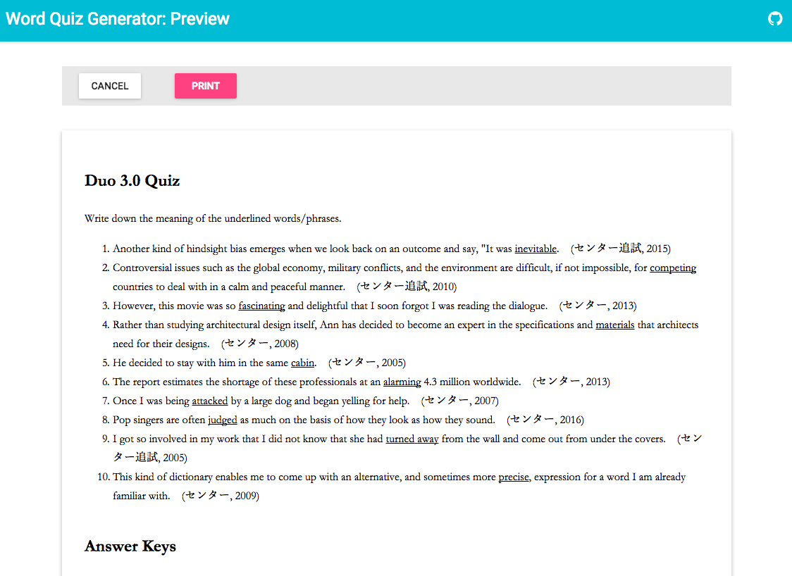

# Online Word Quiz Generator



[](https://travis-ci.org/nodaguti/word-quiz-generator-webapp)
[](https://david-dm.org/nodaguti/word-quiz-generator-webapp)
[](https://david-dm.org/nodaguti/word-quiz-generator-webapp#info=devDependencies)
[](https://codeclimate.com/github/nodaguti/word-quiz-generator-webapp)

A web application for generating a vocabulary quiz.

Once you specify a test material, Online Word Quiz Generator then retrieves a sentence which includes one of the words/phrases in the material from existing source texts, and creates a "Write the definition" questions.

This package features the Web-based GUI.
If you need full control over the quiz generation process, or want to use it from CLI or your program, please use [word-quiz-generator](https://github.com/nodaguti/word-quiz-generator) package.

## Launch
```sh
$ npm start
```

This is a NodeJS application. You need to have the latest version of Node.js.

The app will run on `127.0.0.1:8080` by default. If you want to change it, please specify a new IP address (hostname) and port number through environment variables:

```sh
export IP=192.168.0.1
export PORT=8008
```

## Resources

The lists of materials and sources the application uses are stored in resources.json, which is located on the root of this repository by default.

If you want to change the path, please specify a new path through environment variables:

```sh
export RESOURCES=/path/to/resources.json
```

### Materials

The materials are a CSV-formatted list of words/phrases to be on quiz.

```
{
  "id": "duo",
  "name": "Duo 3.0",
  "lang": "en",
  "sections": "1-45",
  "path": "../data/materials/duo.csv"
}
```

- __id__

  An unique identity.

- __name__

  A material's name which will be shown in the material list on the app.

- __lang__

  The language name in which a material written.
  It must be one of the [IETF language tags](http://unicode.org/cldr/utility/languageid.jsp).

- __sections__

  The number of sections a material has.

- __path__

  The relative path to a material from resources.json.

For more details about the format of a material file, please see [ReadMe at word-quiz-generator repository](https://github.com/nodaguti/word-quiz-generator#material).

### Sources

The sources are a text which will be used on generating a question sentence.

```
{
  "id": "university-of-tokyo-entrance-examination-english",
  "name": "Entrance Exam of University of Tokyo (English, 2005)",
  "lang": "en",
  "path": "../data/sources/en/tokyo/"
}
```

- __id__

  An unique identity.

- __name__

  A source's name which will be shown in the sources list on the app.

- __lang__

  An language name and must be one of the [IETF language tags](http://unicode.org/cldr/utility/languageid.jsp).

- __path__

  A relative path to the material from resources.json.

The app can use a preprocessed and lemmatized text to improve the quality of searching a word/phrase. For more details please see [Preprocessing and Lemmatizing at word-quiz-generator repository](https://github.com/nodaguti/word-quiz-generator#preprocessing-and-lemmatizing).

## Contributing

1. Fork it!
2. Create your feature branch: `git checkout -b my-new-feature`
3. Commit your changes: `git commit -am 'Add some feature'`
4. Push to the branch: `git push origin my-new-feature`
5. Submit a pull request :D

## License

MIT License (http://nodaguti.mit-license.org/)
